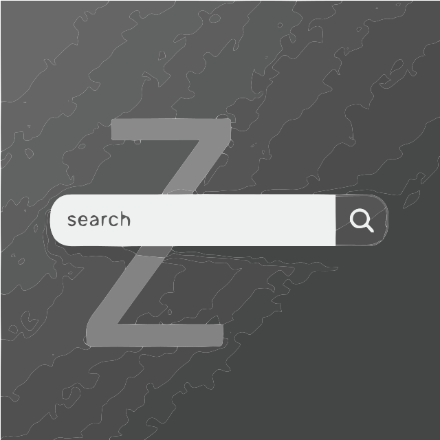

#   Ulauncher Zoxide Extension

A Ulauncher extension for lightning-fast directory navigation powered by the intelligent tracking of [zoxide](https://github.com/ajeetdsouza/zoxide). This extension directly integrates with the `zoxide` command-line tool.

## Features

* **Seamless Zoxide Integration:** Leverages `zoxide query` for accurate, ranked results based on your actual usage patterns.
* **Zoxide Database Updates:** Automatically updates the zoxide database (`zoxide add`) when you select a directory, ensuring the rankings stay relevant.
* **Customizable Action:** Configure which command opens the selected directory (e.g., your preferred file manager like `xdg-open`, `nemo`, `thunar`, or even just opening the directory in a new terminal like `terminator`).

## Prerequisites

* **[Ulauncher](https://ulauncher.io/) v5+:** The application launcher environment.
* **[zoxide](https://github.com/ajeetdsouza/zoxide):** The core command-line tool. Ensure `zoxide` is installed correctly and accessible in your system's `PATH` environment variable for the user running Ulauncher. You can verify this by opening a terminal and running `which zoxide` and `zoxide --version`.

## Installation

1.  **Open Ulauncher Preferences (⚙):** Go to `Extensions` > `Add extension`.
2.  **Paste URL:** Paste the URL of this repository: `https://github.com/vanguard478/ulauncher-zoxide` in `Enter extension URL`
3.  **Click Add:** Ulauncher will download and install the extension.

## Usage

1.  Activate Ulauncher (default shortcut: `Ctrl+Space`).
2.  Type the keyword assigned to this extension (default: `z`).
3.  Follow the keyword with your search terms for the directory (e.g., `z my project docs`).
4.  Ulauncher will display a list of matching directories, ranked by zoxide.
5.  Select the desired directory using the arrow keys and press `Enter`.
6.  The configured `Command on Select` will be executed for that directory (e.g., opening it in your file manager). The zoxide database score for that directory will also be incremented.

## Configuration

Adjust the extension's settings within Ulauncher's preferences:

* **Zoxide Keyword:** The keyword to trigger the search (Default: `z`).
* **Max Results:** The maximum number of directory results to display (Default: `10`).
* **Command on Select:** The shell command executed when you select a directory.
    * Use `{}` as a placeholder for the selected directory path.
    * Examples:
        * `xdg-open {}` (Default - Opens with the system default application)
        * `nemo {}` (Opens with Nemo file manager)
        * `thunar {}` (Opens with Thunar file manager)
        * `terminator --working-directory {}` (Opens a new Terminator terminal in the directory)

## Example 
### Open a file browser using Ulauncher Zoxide: `xdg-open {}` in Extension Setting's `Command on Select`

---
### Open a 'terminator Window' using Ulauncher Zoxide: `terminator --working-directory {}` in Extension Setting's `Command on Select`

## Acknowledgement 
- This project uses `zoxide` by @ajeetdsouza. Source: https://github.com/ajeetdsouza/zoxide (MIT License).